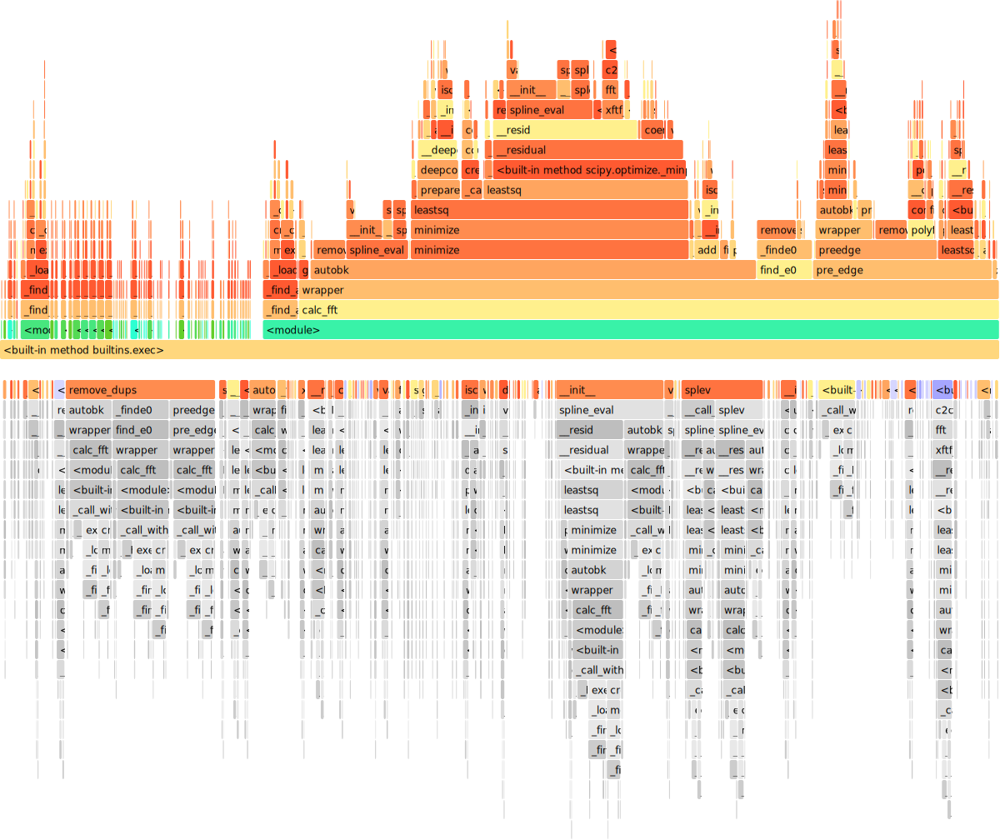

# Profiling of the preedge, autobk, and fft process.

Profinings were performed using the following command:

```bash
sudo cargo flamegraph --bench xas_group_benchmark_parallel
```

## Results

In both cases (numerical and analytical Jacobian), AUTOBK algorithm takes most of the time, and the minimization process is the bottleneck of the entire process. The analytical Jacobian gives roughly x3-4 speedup compared to the numerical Jacobian, but we need to avoid minimization for further speedup.


## Appectix: Profiling of xraylarch

Profile of python + xraylarch (preedge, autobk, and fft) were also measured. In this case, AUTOBK is also the bottleneck of the entire process.
xraytsubaki with single core and numerical Jacobian give similar performance to xraylarch.


