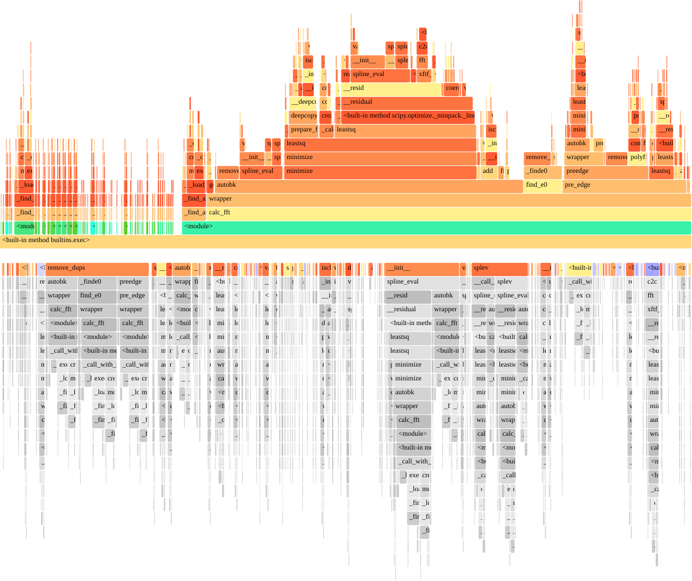

# Profiling of the preedge, autobk, and fft process.

Profinings were performed using the following command:

```bash
sudo cargo flamegraph --bench xas_group_benchmark_parallel
```

## Results

In both cases (numerical and analytical Jacobian), AUTOBK algorithm takes most of the time, and the minimization process is the bottleneck of the entire process. The analytical Jacobian gives roughly x3-4 speedup compared to the numerical Jacobian, but we need to avoid minimization for further speedup.


## Appectix: Profiling of xraylarch

Profile of python + xraylarch (preedge, autobk, and fft) were also measured. In this case, AUTOBK is also the bottleneck of the entire process.
xraytsubaki with single core and numerical Jacobian give similar performance to xraylarch.



## Baseline (Slice A, post-build-unblock)

Date: 2026-02-07

Environment:

- `rustc 1.93.0`
- `cargo 1.93.0`
- `Darwin 25.2.0 arm64`

Dependency state used for this baseline:

- Removed `fftconvolve` dependency path.
- Single FFT stack in runtime path: `easyfft 0.4.2`.
- `cargo tree -p xraytsubaki | rg "easyfft|fftconvolve|anymap"` confirms no `fftconvolve` and only `anymap3` via `easyfft`.

Commands:

```bash
cargo test -p xraytsubaki
/usr/bin/time -l cargo bench -p xraytsubaki --bench xas_group_benchmark_single -- --noplot
/usr/bin/time -l cargo bench -p xraytsubaki --bench xas_group_benchmark_parallel -- --noplot
```

Runtime metrics (Criterion sample p50/p95 from `target/criterion/*/new/sample.json`):

- `xas_group_benchmark_single`:
  - p50: `0.763605 s`
  - p95: `0.932267 s`
  - max RSS (`/usr/bin/time -l`): `261750784` bytes
- `xas_group_benchmark_parallel`:
  - p50: `8.569100 s`
  - p95: `9.034220 s`
  - max RSS (`/usr/bin/time -l`): `1363558400` bytes

Allocation count status:

- Captured with allocator-instrumented runner:
  - command: `cargo run -p xraytsubaki --example alloc_baseline --release`
  - `xas_group_benchmark_single_alloc`:
    - `alloc_calls=4929638`
    - `dealloc_calls=4927810`
    - `realloc_calls=140016`
    - `alloc_bytes=1857394996`
    - `dealloc_bytes=1849003156`
  - `xas_group_benchmark_parallel_alloc`:
    - `alloc_calls=492960408`
    - `dealloc_calls=492780024`
    - `realloc_calls=14000032`
    - `alloc_bytes=185711339084`
    - `dealloc_bytes=184872996900`

Note:

- Allocator instrumentation materially increases runtime; use Criterion numbers above for runtime baselines.

## Slice C/D Follow-up Metrics (post-refactor)

Date: 2026-02-08

Commands:

```bash
cargo test -p xraytsubaki
/usr/bin/time -l cargo bench -p xraytsubaki --bench xas_group_benchmark_single -- --noplot
/usr/bin/time -l cargo bench -p xraytsubaki --bench xas_group_benchmark_parallel -- --noplot
cargo run -p xraytsubaki --example alloc_baseline --release
```

Runtime metrics:

- `xas_group_benchmark_single`:
  - median point estimate: `0.271351 s`
  - p95 sample time: `0.569398 s`
  - max RSS (`/usr/bin/time -l`): `812859392` bytes
  - vs Slice A baseline p50: `+64.47%` faster
- `xas_group_benchmark_parallel`:
  - median point estimate: `6.734452 s`
  - p95 sample time: `8.750525 s`
  - max RSS (`/usr/bin/time -l`): `1203322880` bytes
  - vs Slice A baseline p50: `+21.41%` faster

Allocation counters (allocator-instrumented runner):

- `xas_group_benchmark_single_alloc`:
  - `alloc_calls=4927039`
  - `dealloc_calls=4925211`
  - `realloc_calls=139716`
  - `alloc_bytes=1847362572`
  - `dealloc_bytes=1838970732`
- `xas_group_benchmark_parallel_alloc`:
  - `alloc_calls=492700407`
  - `dealloc_calls=492520024`
  - `realloc_calls=13970032`
  - `alloc_bytes=184708089048`
  - `dealloc_bytes=183869746912`
