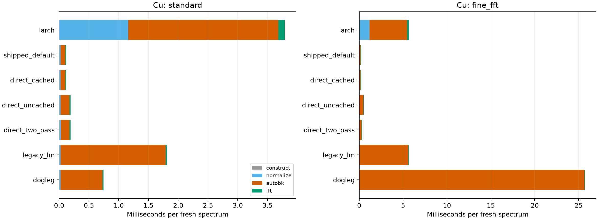
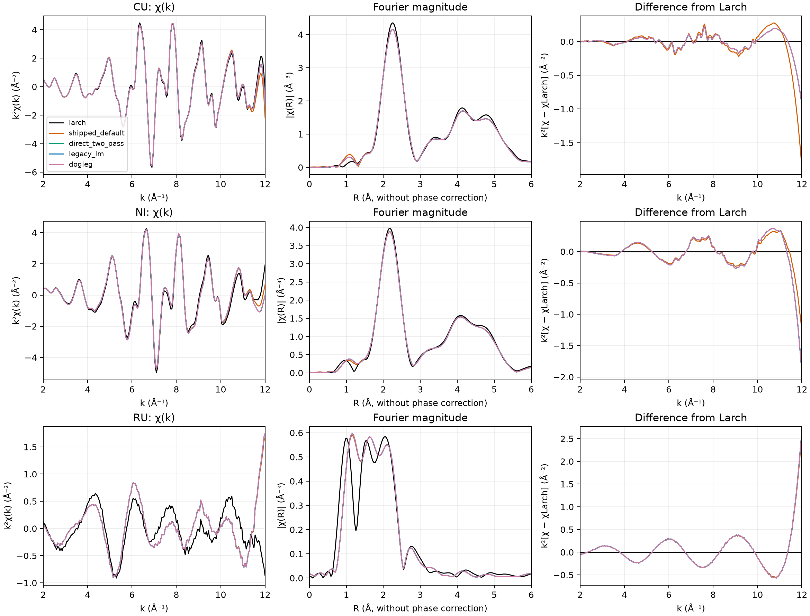

# XrayLarch and rexafs: timing, output agreement and CPU profiles

Measured on 2026-09-06 with the published **rexafs 0.1.0** Python wheel and
**XrayLarch 2026.3.1**. The plotting fix in rexafs 0.1.1 does not change the
scientific algorithms measured here. These are measurements of specific public
API calls, not a claim that the two implementations do identical work or that
agreement with Larch establishes scientific accuracy.

The default rexafs pipeline was **25.6–31.6× faster** on the three original scans
with the standard settings. However, its χ(k) relative L2 differences from Larch
were **6.21% for Cu, 7.62% for Ni, and 37.50% for Ru**. These differences must be
considered alongside the timing results. Changing optimizer alone does not make
the implementations equivalent.

## Retained evidence and reproduction

- [All 112 comparisons](baseline-0.1.0/measurements.md), with
  [CSV](baseline-0.1.0/metrics.csv) and [JSON](baseline-0.1.0/metrics.json).
- Every case's JSON retains its seven timing samples per stage, first-call time,
  batch size, parameters, memory measurements, versions, input hashes and binary
  hash. Adjacent NPZ files retain the numerical arrays; the report is regenerated
  from these arrays, not rounded values in a table.
- [Controlled parity experiments](baseline-0.1.0/parity-diagnostics.json) and
  their `diagnostic--*.npz` arrays.
- [Python and native CPU profiles](profiles-0.1.0/): `.pstats`, cumulative call
  tables, native sample status, demangled native samples compressed with gzip,
  and native top-of-stack tables. Native collection succeeded for all nine runs.
- [Exact Python dependencies](requirements.txt). The numerical baseline uses
  Python 3.12.12, NumPy 2.5.2, SciPy 1.18.1 and lmfit 1.3.4 on macOS 26.5.1,
  Apple M4 (10 cores), 32 GiB RAM. It uses one numerical worker; thread controls
  and detected thread pools are recorded in every case.

Run from the repository root, in an isolated environment:

```sh
uv venv --python 3.12 .venv-larch-benchmark
uv pip sync --python .venv-larch-benchmark/bin/python doc/benchmarks/2026-09-06-larch/requirements.txt
.venv-larch-benchmark/bin/python scripts/benchmark-larch.py --rounds 7 --output /tmp/larch-results
.venv-larch-benchmark/bin/python scripts/report-larch-benchmark.py /tmp/larch-results
.venv-larch-benchmark/bin/python scripts/diagnose-larch-parity.py /tmp/larch-results
.venv-larch-benchmark/bin/python scripts/profile-larch-benchmark.py --output /tmp/larch-profiles
.venv-larch-benchmark/bin/python scripts/profile-larch-benchmark.py --setup fine_fft --configs dogleg legacy_lm shipped_default larch --output /tmp/larch-profiles
```

Native profiles require macOS `sample`. Rust symbols in the retained files were
demangled with `rustfilt 0.2.1`; this changes names, not sample counts. The earlier
standard profiles precede formatting-only changes to the benchmark script, so
their line numbers and script hashes differ from the final timing harness.

## Workload and fairness limits

Each timed iteration constructs a **new spectrum**, normalizes, removes its
background, and performs the forward transform. Repeating `fft()` on an already
processed rexafs spectrum would measure the result cache and is deliberately
excluded. File loading, shared E0 selection, output extraction, plotting and
profiling are outside the timing intervals. Configuration objects are prepared
before timing. Rexafs construction copies the input and configures a spectrum;
Larch construction attaches the existing arrays to a new Group.

Each case runs in its own process, with three warm-ups and seven batches of
fresh spectra. Batch sizes are recorded (3–50). Cases are shuffled with a fixed
seed and run sequentially. The median and p95 summarize **batch means**, not
individual-spectrum tail latency. First-call measurements include cold caches.
The Mac was also running its normal desktop session; these are workstation
measurements, not results from a dedicated, frequency-locked benchmark host.

Both numerical stacks are imported in every worker. Total peak RSS therefore
includes both stacks. Incremental peak RSS measures growth beyond imports and
setup; it is not allocation count or the isolated library import footprint.
Memory fields and spectra/second are available in the CSV.

| Matrix dimension | Values |
|---|---|
| Measured scans | Cu 150 K, 618 points; Ni metal room temperature, 418 points; Ru QAS, 645 points |
| Size scaling | Cu resampled to 8,192 and 32,768 energy points by linear interpolation; these are synthetic dense grids, not additional measured scans |
| Main numerical settings | Standard: nfft=2048, Δk=0.05; fine: nfft=8192, Δk=0.025 |
| Algorithms | Larch; rexafs shipped default; direct cached; direct uncached; direct two-pass clamps; legacy LM; trust-region Dogleg |
| Ablations | No clamps; no clamps with kmax=12.8, where knot/cutoff rounding agrees |

All runs share an explicitly selected E0 and normalization ranges: pre-edge
[-150,-30] eV and post-edge [150,700] eV relative to E0, quadratic normalization,
Victoreen exponent zero. Each worker also records rexafs' independently detected
E0, but that value is not used to bias the matched calculation. AUTOBK uses
rbkg=1 Å, k=[0,12] Å⁻¹, kweight=1, Hanning, dk=0.1, three endpoint clamp points,
low/high clamp weights 0/1. The forward transform uses k=[2,12] Å⁻¹, kweight=2,
Kaiser-Bessel, dk=dk2=1, and R output through 10 Å. Ablations override only the
listed parameters.

Larch `pre_edge(make_flat=True)` also computes alternate flattening with lmfit
and derivative arrays. Its AUTOBK call has propagated uncertainty calculation
disabled, but still obtains covariance/coefficient statistics. Rexafs' public
pipeline does less ancillary work. Consequently the pipeline speedup is useful
for these API workflows, but it cannot be attributed entirely to Rust versus
Python or entirely to the background solver.

## Timing results

Median milliseconds per fresh spectrum, standard settings:

| Implementation | Cu | Ni | Ru | Cu 8,192 points | Cu 32,768 points |
|---|---:|---:|---:|---:|---:|
| Larch | 3.7793 | 3.6147 | 3.4490 | 12.4582 | 42.5740 |
| Rexafs default | 0.1195 | 0.1246 | 0.1345 | 0.5831 | 1.9682 |
| Direct cached, fallback disabled | 0.1199 | 0.1152 | 0.1223 | 0.5251 | 1.8745 |
| Direct uncached, fallback disabled | 0.1915 | 0.1884 | 0.2068 | 0.5975 | 2.1247 |
| Direct two-pass clamps | 0.1927 | 0.1682 | 0.1923 | 0.6433 | 2.1983 |
| Legacy LM | 1.8056 | 2.0655 | 1.8489 | 3.4779 | 10.8310 |
| Trust-region Dogleg | 0.7437 | 0.7309 | 0.8205 | 2.1549 | 6.3595 |

Default and strict cached-direct output arrays agree; disabling fallback did not
fail any matrix case. Their separately measured timing differences are noise
and scheduling variability, not a different intended algorithm. Turning off
the workspace cache costs roughly 0.07–0.085 ms on the small standard scans.
This cache reuses design data; it does not reuse the completed spectrum.



The fine-grid Cu Dogleg result is an important exception: **25.7133 ms**, versus
5.6594 ms for rexafs LM and 0.2136 ms for the default direct solver. Its dedicated
profile spends **99.62%** in background subtraction. Native samples are dominated
by repeated RustFFT transforms inside residual/Jacobian evaluation, followed by
spline basis evaluation. A finer transform makes each evaluation more expensive;
Dogleg's trust-region path and stopping criteria can also require more work for
this input. The public binding does not expose iteration/termination counts, so
these measurements do **not** establish that it hit the 100-iteration limit.
LM and Dogleg produce almost identical χ for this case despite the timing gap.

## Why the speed gap occurs

Both implementations use the AUTOBK idea of choosing a smooth spline background
by suppressing low-R Fourier components. Larch uses MINPACK Levenberg-Marquardt
with a finite-difference Jacobian, evaluates a spline on the measured k grid and
fits a cubic interpolating spline to the residual on each evaluation. Rexafs'
iterative solvers reuse an analytical spline basis/Jacobian. The default rexafs
solver instead freezes the endpoint clamp scale and solves the resulting affine
least-squares system directly with a column-scaled, regularized **SVD**. Two-pass
mode updates the clamp scale and solves again. These are different numerical
procedures, not merely different language bindings.

Python cProfile shares on standard Cu (overlapping internal call totals are not
added together):

| Implementation | Construction | Normalization | AUTOBK | Forward FFT |
|---|---:|---:|---:|---:|
| Larch | 0.05% | 38.90% | 57.57% | 3.46% |
| Rexafs default | 4.90% | 14.79% | 65.02% | 13.07% |
| Rexafs uncached direct | 3.11% | 9.29% | 78.02% | 8.18% |
| Rexafs legacy LM | 0.39% | 1.05% | 97.48% | 0.90% |
| Rexafs Dogleg | 1.05% | 2.53% | 93.75% | 2.21% |

Larch's standard profile has 71,889 AUTOBK residual calls over 2,319 spectra
(31 calls per spectrum), and 76,527 spline evaluations. Repeated FITPACK spline
construction/evaluation and optimizer calls account for much of its cost.
The alternate normalization fit alone has 2.294 seconds of cumulative time in
the 15-second profile. Native Larch samples also expose compiled FITPACK and FFT
work, so this is not all Python interpreter overhead.

The rexafs default native profile shows spline basis evaluation (1,510 leaf
samples), SVD construction (447), Householder reduction (256), and FFT kernels
(303 in one radix-4 kernel). This locates remaining work below the Python binding.
These are **leaf sample counts**, not inclusive totals or allocation counts.
Profiling itself changes timing; use the unprofiled matrix for speed comparisons.

## Output agreement and explanation of gaps

The CSV reports normalization/flattening and χ errors (relative L2, RMSE and
maximum absolute difference), Fourier magnitude errors, strongest-peak shift and
height change over R=[1,3] Å, and complex FFT agreement on identical χ input.
χ errors use k=[2,kmax]; Fourier magnitude errors use the retained R=[0,10] Å
grid. Peak positions are **without phase correction**, not inferred bond lengths.



Standard settings:

| Dataset | Default χ relative L2 | Two-pass χ relative L2 | LM / Dogleg χ relative L2 | Default Fourier magnitude relative L2 |
|---|---:|---:|---:|---:|
| Cu | 6.206% | 4.097% | 4.092% | 5.534% |
| Ni | 7.622% | 9.007% | 9.007% | 4.157% |
| Ru | 37.505% | 37.984% | 37.980% | 28.434% |

Normalized μ agrees much more closely (maximum absolute differences approximately
2.81e-6, 3.20e-10 and 2.54e-7 respectively). Two-pass clamps do not uniformly
improve agreement. Ru's strongest peak in the selected R interval switches
between nearby peaks, giving a -0.890 Å peak metric; this is not evidence of a
physical bond shortening.

Three implementation differences explain why equal input settings can differ:

1. **Knot and R-cutoff integer conversion.** Rexafs rounds where Larch truncates.
   At rbkg=1 and kmax=12, rexafs selects 9 spline points and 35 low-R bins;
   Larch selects 8 and 30. This changes the background model and objective.
2. **Interpolation and endpoint penalties.** Rexafs linearly resamples μ once
   and evaluates the background on uniform k. Larch cubically resamples the
   measured-grid residual each time. The iterative endpoint scale is also
   `1 + 100*mean(residual²)` in rexafs versus `0.1 + 10*mean(residual²)` in Larch;
   their high-end clamp slices differ by one sample. Default direct mode fixes
   that scale at its initial value; iterative modes update it.
3. **Fourier window domain.** Rexafs builds the window on the supplied k grid;
   Larch constructs it on an extended grid through at least `kmax+dk2`, then
   truncates it. If supplied data end at kmax, this changes the Kaiser window's
   center and width across its full support. Feeding the same χ to the public
   transforms gives 4.23–14.78% complex relative L2 differences here. Using the
   same finite-grid window reduces these to **6.1e-16–7.7e-16**. This rules out
   an FFT-kernel precision explanation for that difference in these cases.

A controlled experiment holds kmax=12 and disables clamps, then changes Larch
rbkg to 1.05 solely to select the same 9 knots and 35 bins. A further diagnostic
replaces Larch's residual resampling with the rexafs-style affine expression.
These modified Larch calls are **diagnostics only**, not benchmark results for
the unmodified package. Relative L2 here uses rexafs' no-clamp χ as denominator:

| Dataset | Original Larch settings | Matched knots/cutoff | Also matched resampling |
|---|---:|---:|---:|
| Cu | 4.087% | 1.538% | 0.00308% |
| Ni | 9.085% | 0.960% | 0.00713% |
| Ru | 44.249% | 1.588% | 0.40087% |

Thus knot/cutoff choice accounts for most of this Ru discrepancy, while
interpolation explains much of the remaining Cu/Ni discrepancy. Residual
differences remain, including solver regularization and stopping behavior;
the experiment does not assign every remaining error to a single cause.
The separate kmax=12.8 ablation is also retained, but changes the analysis range
and should not be interpreted as a same-range causal test.

The measured scans have no known true background, so this report measures
agreement, not an accuracy ranking. It does not validate fit parameters,
uncertainty coverage, reverse transforms, multi-spectrum parallel throughput,
WASM performance, or GPU plotting latency. Scientific parity changes need their
own regression fixtures and review; this plot-rendering release preserves the
existing numerical behavior.

## Sources

- [Larch AUTOBK documentation](https://xraypy.github.io/xraylarch/xafs_autobk.html)
  and [normalization documentation](https://xraypy.github.io/xraylarch/xafs_preedge.html).
- Exact Larch 2026.3.1 source:
  [AUTOBK](https://github.com/xraypy/xraylarch/blob/860d8a690c81eefb0e61dee4ca3703ef4b67e93d/larch/xafs/autobk.py),
  [normalization](https://github.com/xraypy/xraylarch/blob/860d8a690c81eefb0e61dee4ca3703ef4b67e93d/larch/xafs/pre_edge.py),
  [Fourier preparation](https://github.com/xraypy/xraylarch/blob/860d8a690c81eefb0e61dee4ca3703ef4b67e93d/larch/xafs/xafsft.py).
- Rexafs 0.1.0 source:
  [background and solvers](https://github.com/Ameyanagi/rexafs/blob/v0.1.0/crates/rexafs/src/xafs/background.rs),
  [Fourier transform](https://github.com/Ameyanagi/rexafs/blob/v0.1.0/crates/rexafs/src/xafs/xrayfft.rs),
  [window functions](https://github.com/Ameyanagi/rexafs/blob/v0.1.0/crates/rexafs/src/xafs/xafsutils.rs).
- [Input collection attribution](../../../crates/rexafs/tests/testfiles/xraylarch_d867/README.md).
