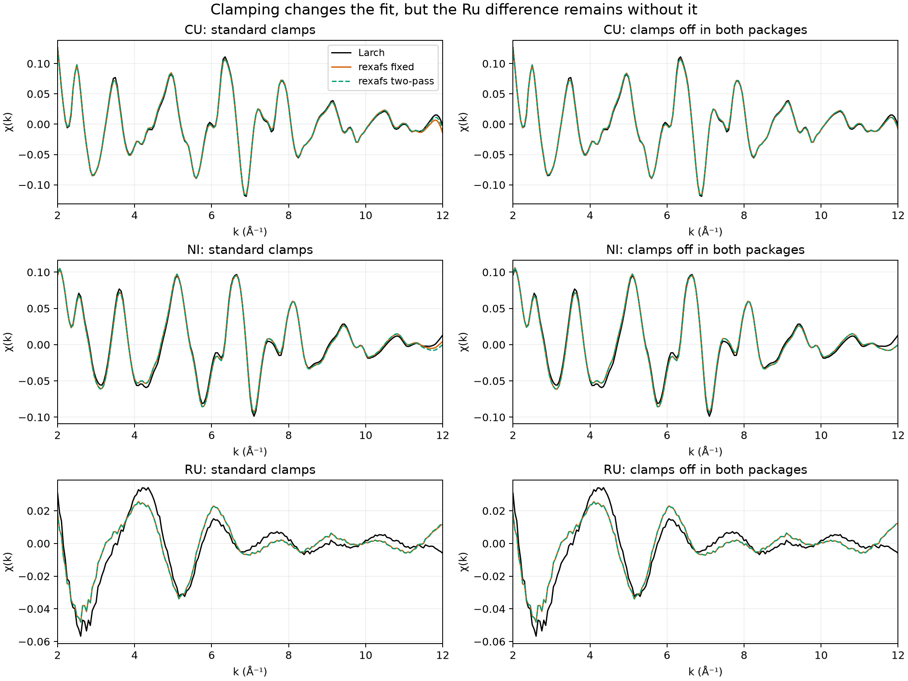

# Why χ(k) differs: controlled clamping experiments

Clamping contributes to the difference, particularly between rexafs' fixed and
two-pass solvers. It does **not** explain the large Ru discrepancy in this data
set. Turning clamps off in both public packages leaves that discrepancy intact.

These results use the same published rexafs 0.1.0 and XrayLarch 2026.3.1 environment,
inputs, shared E0, normalization, k=[0,12], rbkg=1, Δk=0.05 and nfft=2048 as the
[main report](../README.md). Errors below measure unweighted χ over k=[2,12].
They measure agreement with Larch, not accuracy against a known background.

## Public APIs: switch clamps off in both packages

Each percentage is `||χrexafs − χLarch||₂ / ||χLarch||₂`, using Larch with the
same clamp on/off setting. This uses the Larch denominator consistently; the
earlier parity-diagnostics table explicitly used a rexafs denominator instead.

| Dataset | Standard clamps, rexafs fixed | Standard clamps, rexafs two-pass | Clamps disabled in both, rexafs direct |
|---|---:|---:|---:|
| Cu | 6.2055% | 4.0971% | 4.0511% |
| Ni | 7.6216% | 9.0073% | 9.0573% |
| Ru | 37.5053% | 37.9839% | 38.1877% |



Compare each library to **its own** result with clamps disabled:

| Dataset | Larch clamp effect | Rexafs fixed clamp effect | Rexafs two-pass clamp effect |
|---|---:|---:|---:|
| Cu | 0.0007% | 2.7470% | 0.0652% |
| Ni | 0.0016% | 2.0407% | 0.0587% |
| Ru | 0.0017% | 0.9902% | 0.2943% |

The denominator in this second table is each library's own no-clamp result.
Clamping can move a result closer to Larch by coincidence, as it does for Ni;
closer agreement alone does not prove that a clamp policy is better.

Ru also has a weaker χ signal: standard Larch RMS χ is approximately 0.0174,
versus 0.0446 for Cu and 0.0428 for Ni. The default Ru discrepancy has RMS 0.00653
and maximum absolute difference 0.01761. Its larger relative percentage reflects
both a larger absolute background difference and a smaller signal denominator.

## Three separate clamp choices

Let `u` be the vector containing the real and imaginary low-R FFT residuals, and
`q` the endpoint χ residuals **before division by the edge step**. The least
squares objective adds `||s q||²` to `||u||²`.

| Choice | Larch 2026.3.1 | Rexafs 0.1.0 |
|---|---|---|
| Scale at the same residual | `s = 0.1 + 10 mean(u²)` | `s = 1 + 100 mean(u²)` |
| High-end samples for nclamp=3 | Last three, k=11.90, 11.95, 12.00 | One sample earlier: k=11.85, 11.90, 11.95 |
| Scale updates | Recalculate at each residual evaluation | Default fixed at the initial guess; two-pass updates once; LM/Dogleg recalculate |

Thus rexafs has **10× the scale and 100× the squared endpoint penalty at the
same residual and clamp weight**. This does not mean its final fit differs by
100×: the residual, background model and update policy also change.
These are soft endpoint penalties, not hard constraints forcing χ to zero.
The low-end weight is zero throughout these experiments.

Freezing the initial scale matters because the initial spline has much larger
low-R residuals than the fitted spline. In the controlled, aligned-model fits:

| Dataset | Rexafs-form scale at initial guess | Scale recalculated after the first fixed fit | Dynamic-fit final scale |
|---|---:|---:|---:|
| Cu | 29.47496 | 1.11253 | 1.06028 |
| Ni | 42.93460 | 1.25200 | 1.21724 |
| Ru | 1.91306 | 1.02047 | 1.02040 |

These are diagnostic Larch fits using rexafs' scale formula and model, not
internal telemetry from the rexafs binary. Their fixed-policy output agrees
with the published rexafs default within 0.0024%, 0.0065% and 0.3871% respectively.
This provides a numerical cross-check of the model reconstruction.

## Hold the optimizer constant and change one choice

The retained experiment crosses two background models, two scale multipliers,
two endpoint slices and three update policies: 24 cases per dataset, plus two
no-clamp controls. All **78 fits** use Larch's MINPACK solver and stopping
settings. The unmodified combination reproduces the stored Larch χ to an
absolute tolerance of 1e-12 plus relative tolerance of 1e-10.

Changing only one clamp choice in the otherwise unmodified Larch calculation
produces these differences from standard Larch:

| Single change | Cu | Ni | Ru |
|---|---:|---:|---:|
| Multiply scale by 10, still update dynamically | 0.0643% | 0.1516% | 0.1687% |
| Shift high-end slice one sample earlier | 0.0007% | 0.0007% | 0.0004% |
| Freeze Larch's scale at its initial value | 1.2090% | 2.7438% | 0.0107% |

The effects interact; these percentages must not be added or treated as a
variance decomposition. In particular, freezing a scale that is already 10×
larger can have a different effect from either change on its own.

The second background model retains kmax=12 but sets Larch rbkg=1.05 solely to
select the same **9 spline parameters and 35 low-R bins** as rexafs at rbkg=1.
It also substitutes rexafs-style linear μ resampling and evaluates the background
on uniform k. Standard Larch instead selects 8 parameters/30 bins and cubically
resamples the measured-grid residual. With **Larch's original clamping retained**,
this aligned model already differs from standard Larch by 4.0497% for Cu, 9.0531%
for Ni and **38.2497% for Ru**. That isolates the large Ru effect from clamping.

The earlier [no-clamp diagnostics](../baseline-0.1.0/parity-diagnostics.json)
separate count selection from interpolation: for Ru, matching counts reduces
the discrepancy from 44.249% to 1.588%, then matching interpolation reduces it
to 0.40087%, with the rexafs no-clamp denominator fixed for all three entries.
Differences in regularization, spline implementation and solver stopping remain;
we do not assign that remaining error to one cause without further experiments.

## Additional finding: iterative clamp Jacobian

Code inspection found that rexafs' dynamic residual uses `s(c) q(c)`, while its
analytical Jacobian supplies only `s(c) dq/dc`. It omits `q(c) ds/dc`. For
`s = 1 + 100 mean(u²)`, the missing scale derivative is
`ds/dc = 200 uᵀ J_u / len(u)`.

A central finite-difference check against the actual Rust implementation confirms
this on a synthetic spline. The low-R Jacobian agrees within 6.30e-11 relative
error. The endpoint rows agree within 7.94e-11 when the scale is explicitly fixed,
but have **42.27% relative error** when it changes with the coefficients.
The [diagnostic source](clamp-jacobian-diagnostic.rs) and
[result/source hash](clamp-jacobian-result.txt) are retained. The tested
`background.rs` is byte-identical to the v0.1.0 source.

This is a derivative-consistency defect in LM/Dogleg's dynamic path. The default
fixed-scale direct solve and each fixed solve in two-pass mode do not require
this derivative. The 42.27% is a **Jacobian error on synthetic input**, not a
χ(k) error on the measured scans. It may affect convergence; establishing its
contribution to the fine-grid Dogleg timing outlier needs a corrected-solver
comparison. It does not overturn the no-clamp Ru result above.

To reproduce, append the retained diagnostic module to `background.rs` in a
temporary checkout of v0.1.0, then run:

```sh
cargo test --release -p rexafs --lib compare_clamp_jacobian_to_finite_differences -- --nocapture
```

The diagnostic deliberately asserts that the known dynamic mismatch exists;
it is not a passing correctness test for that implementation. A production fix
needs a regression test requiring agreement and a new scientific-output matrix.
The plot-rendering release does not change the scientific algorithms.

## Reproduce and inspect

```sh
.venv-larch-benchmark/bin/python scripts/diagnose-larch-clamping.py \
  doc/benchmarks/2026-09-06-larch/baseline-0.1.0 \
  --output /tmp/clamping-results
```

- [clamping.json](clamping.json) records all cases, input/source/script hashes,
  package versions, fit status/evaluation counts, initial/final scales, loss
  components and comparison errors. Counts belong to the diagnostic MINPACK
  fits, not rexafs' internal solvers.
- [cu.npz](cu.npz), [ni.npz](ni.npz), [ru.npz](ru.npz) retain every χ curve.
- [SVG figure](clamps-on-off.svg) is available for export.
- The modified Larch fits are causal diagnostics, **not** timings for the public
  Larch package and not proposed production changes.

Code references: [Larch residual and endpoint slices](https://github.com/xraypy/xraylarch/blob/860d8a690c81eefb0e61dee4ca3703ef4b67e93d/larch/xafs/autobk.py#L31-L48),
[rexafs scale, residual and Jacobian](https://github.com/Ameyanagi/rexafs/blob/v0.1.0/crates/rexafs/src/xafs/background.rs#L1096),
and [rexafs fixed/two-pass solve](https://github.com/Ameyanagi/rexafs/blob/v0.1.0/crates/rexafs/src/xafs/background.rs#L1427).
Follow-up compatibility decisions are tracked in [issue #20](https://github.com/Ameyanagi/rexafs/issues/20).
