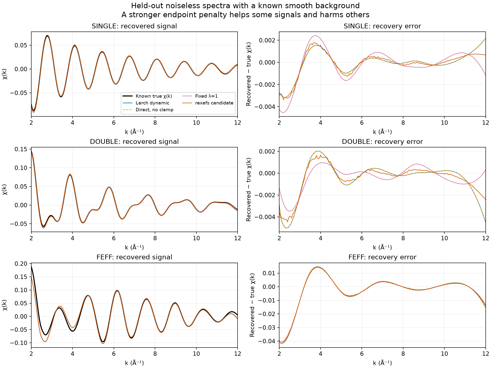
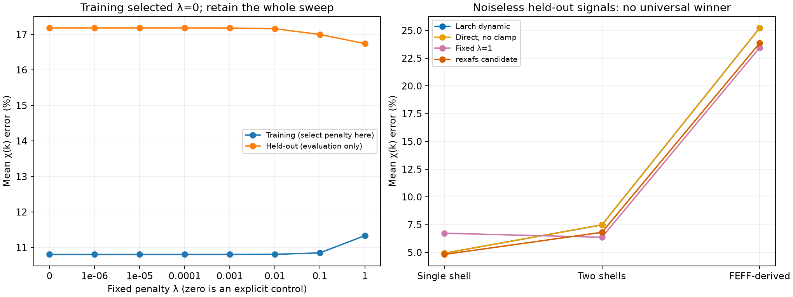
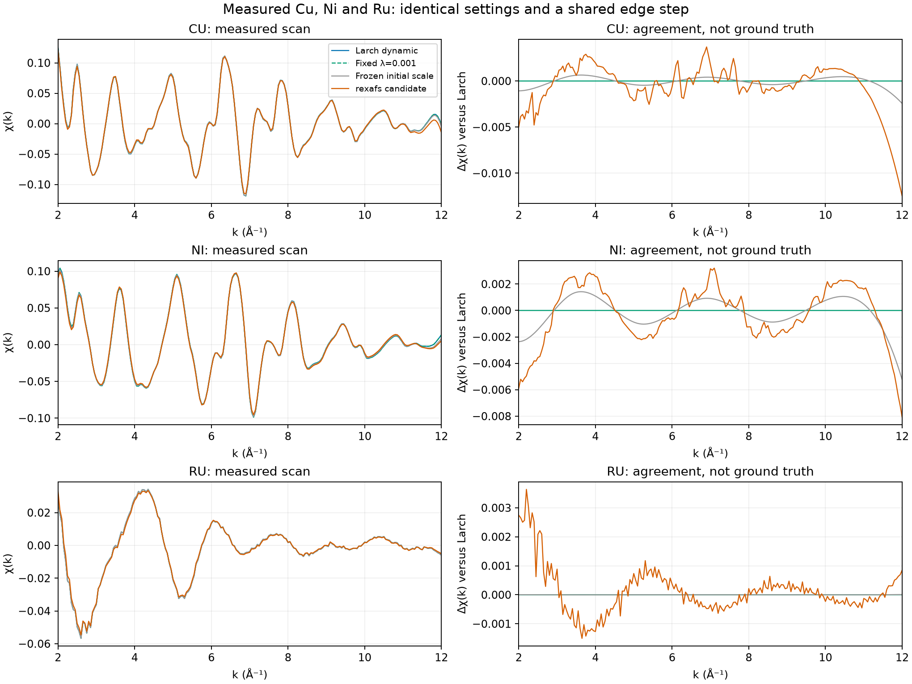

# AUTOBK clamping: signal recovery and a single linear solve

This is the retained **pre-implementation study** (floor-only candidate measured
before commit `8d97a94`). Its rexafs timing/output rows do not measure the later
production fixed-λ implementation. See the [fixed-λ specification](../../autobk-fixed-penalty.md)
for the subsequently selected configurable default λ=0.001.

The experiment supports retaining a direct linear solve. It does **not** establish
a universal clamp strength or justify changing the production default yet.
Larch's dynamic clamps and a weak, fixed penalty recover almost the same signal
in the primary matrix. Stronger penalties help some synthetic signals and damage
others. Freezing a scale calculated from the initial background can impose a much
stronger constraint than intended.

This is an experimental Python implementation and evaluation, not a new Rust
clamp mode. The local rexafs 0.1.1 candidate has only the requested automatic
spline-count change from `round()` to `floor()` in its scientific implementation.
Its clamp formula, endpoint selection, regularization and defaults are unchanged.

## What was tested

There are **322 inputs/configurations and 3,542 primary method fits**, with every
input, output and score retained in [raw-cases.zip](raw-cases.zip) and [metrics.csv](metrics.csv). The archive contains
`study.json` and each case's original NPZ/JSON pair, byte-for-byte:

- 112 synthetic training cases and 168 held-out cases. These combine one- and
  two-shell analytic oscillations, two smooth backgrounds, signal amplitudes 0.3
  and 1, kmax 10 and 12 Å⁻¹, and Gaussian noise σ=0, 0.0003 and 0.003 relative to a
  known unit edge step. Noisy cases use three seeded realizations; noiseless cases
  are not duplicated. Test radii, phases, background parameters and random seeds
  differ from training. A retained FEFF-derived signal is used only for testing.
- 12 measured cases: Cu, Ni and Ru, kmax 10/12, and the standard/fine FFT grids
  from the [original benchmark](../2026-09-06-larch/README.md). E0 and the measured
  Larch normalization edge step are shared within each comparison.
- 30 additional sensitivity cases at clamp_hi=10 and 50: 24 synthetic and six
  measured. These were added after the primary pilot, are labeled `stress`, and
  are excluded from penalty selection. They reuse matching inputs to isolate
  clamp strength.

Eleven methods are run per case: stock Larch's dynamic fit, eight fixed penalties
λ=0, 10⁻⁶, 10⁻⁵, 10⁻⁴, 10⁻³, 10⁻², 0.1 and 1, a fixed initial Larch scale, and
the actual rexafs Python binding with `LinearDirect`, `Fixed`, caching enabled
and iterative fallback disabled. λ=0 is the explicit no-clamp control.

The common-model methods use **exactly Larch's spline basis, interpolation,
low-R cutoff, window, endpoint indices and initial coefficients**. Only the clamp
rule and solution method change. The rexafs binding is a separate public-API
comparison: it still differs in interpolation, cutoff rounding, clamp scale,
endpoint slice and regularization, so its differences cannot be attributed solely
to clamping.

The measured scans have no known true background. Their scores measure agreement
with Larch. Synthetic scores measure recovery of the independently specified
χ(k), not agreement with another package. Synthetic E0 and edge step are known
and supplied to both methods so normalization error does not confound this test.

## The two objectives

Let χ(c)=y+Jc be the affine, edge-step-normalized spline residual, `r(c)` its
low-R real/imaginary FFT residual, and `e(c)` the weighted endpoint residual.
The reference calls the installed, unmodified
[Larch implementation](https://github.com/xraypy/xraylarch/blob/860d8a690c81eefb0e61dee4ca3703ef4b67e93d/larch/xafs/autobk.py#L26)
and updates the scale at every residual evaluation:

```text
s(c) = 0.1 + 10 mean((edge_step × r(c))²)
reference residual = [r(c), s(c) e(c)]
```

The edge-step factor above preserves Larch's raw-μ scaling after expressing the
equations in normalized units. The derivative includes both `s J_e` and
`e ∇s`; the latter is essential when verifying a dynamic implementation.

The fixed prototype minimizes:

```text
mean(r(c)²) + λ mean_active(e(c)²)
```

Only active endpoint rows enter the endpoint mean. Here clamp_lo=0, nclamp=3,
and `e = clamp_hi × χ` at the final three points. Thus increasing clamp_hi also
squares that weight in the loss. Both residual blocks are affine, so this is one
augmented least-squares problem. The prototype uses **one column-scaled SVD solve**,
without coefficient iteration, ridge search or fallback. λ is independent of
the initial background and raw absorption units. It is a regularized formulation,
not a claim of a novel background-subtraction algorithm.

The frozen-initial control uses Larch's scale computed once at its initial
coefficients. It is distinct from rexafs' existing fixed-scale implementation.

## Recovery of known signals

Penalty selection minimizes mean training χ(k) relative L2 error over 2≤k≤kmax.
Training selected **λ=0**. The small penalties are practically tied: training
mean error is 10.8048% at zero and 10.8052% at λ=0.001. This is not strong evidence
that precisely zero is optimal. Test results were not used to select λ; the full
sweep remains available, including test cases that favor a stronger penalty.

Mean held-out χ(k) error, including both backgrounds, both k ranges and all noise
levels:

| Method | Relative L2 error | Endpoint RMSE, final 1 Å⁻¹ |
|---|---:|---:|
| Larch dynamic | 17.1803% | 0.004647 |
| Direct, no clamp | 17.1814% | 0.004648 |
| Fixed λ=0.001 | 17.1792% | 0.004645 |
| Fixed λ=1 | 16.7409% | 0.003259 |
| Frozen initial Larch scale | 17.1197% | 0.004556 |
| rexafs candidate, direct only | 15.7294% | 0.003490 |

These averages are not a ranking of general scientific accuracy. In particular,
the rexafs method changes more than clamping, and the synthetic corpus is small
in physical diversity despite having many configurations. Large relative errors
are especially sensitive to weak signals and added noise; absolute RMSE,
k²-weighted error, background error and complex R-space error over 1–4 Å are
retained alongside relative χ error.

The conflict is clearer on **noiseless held-out signals**:

| Signal family | Larch dynamic | Direct, no clamp | Fixed λ=0.001 | Fixed λ=1 |
|---|---:|---:|---:|---:|
| Single shell | 4.9260% | 4.9260% | 4.9259% | 6.7251% |
| Two shells | 7.4806% | 7.4828% | 7.4784% | 6.3653% |
| FEFF-derived | 25.2255% | 25.2270% | 25.2239% | 23.4497% |

The strong penalty improves the latter two families while damaging the first.
Forcing the endpoint toward zero is a prior assumption: real oscillations need
not end at zero. A better optimizer cannot remove that tradeoff.





### Why are some truth errors still large?

For 12 noiseless test cases, the linear prototype was applied separately to the
known signal and background. Their outputs reconstruct the full fit to numerical
precision. This separates interpolation error, signal absorbed by the fitted
background, and background leakage. [The component arrays and checks](error-decomposition.json)
are retained; the component error norms are **not additive**.

For the FEFF-derived, bumped-background case with amplitude 1 and kmax=12, the
unclamped error has RMSE 0.011867. Its signal-removal component has RMSE 0.011705,
background leakage 0.000291, and signal interpolation error 0.00000144. The
dominant problem is signal absorption into the background model. The near-identical
Larch result shows that updating the clamp does not resolve this case. This is a
finding for the constructed signal and chosen rbkg/window, not an assertion about
all FEFF calculations or all physical scans.

## Measured scans and stronger clamps

χ(k) relative L2 differences from Larch, standard grid, rbkg=1, kmax=12,
clamp_hi=1:

| Method | Cu | Ni | Ru |
|---|---:|---:|---:|
| Direct, no clamp, common model | 0.000668% | 0.001604% | 0.001747% |
| Fixed λ=0.001, common model | 0.000594% | 0.001071% | 0.001642% |
| Frozen initial Larch scale | 1.208952% | 2.743768% | 0.010670% |
| rexafs candidate, direct only | 5.800993% | 5.154450% | 4.725006% |



At clamp_hi=50, freezing the initial Larch scale differs from dynamic Larch by
37.37% on Cu and 15.83% on Ni. The no-clamp common-model differences are 0.99%
and 2.33%, respectively. Thus the weak-clamp agreement above must not be
generalized to intentionally strong clamps. These stress comparisons establish
sensitivity, not which output is scientifically correct on the measured scans.

Absorption-unit checks scale μ and edge_step together by 0.1/10, or add a constant
offset. Fixed λ=0.001 changes only at floating-point precision (relative changes
below 2×10⁻¹³ in these checks). Larch's raw-μ-dependent scale is not exactly unit
invariant; the largest observed change here is about 0.1333% for Ni scaled by 10.

## Timing and profiling

[Timing samples](timings.json) use three warmups and seven rounds of 20 fresh
fits, shuffled method order, on the same Apple M4/Python 3.12.12 environment with
one numerical thread. These are **background-stage** timings with common E0 and
edge step; normalization and Fourier transformation of the final χ are excluded.
The prototype includes matrix preparation unless explicitly marked otherwise.

| Method, median milliseconds | Cu | Ni | Ru |
|---|---:|---:|---:|
| Larch dynamic | 2.8141 | 4.0484 | 3.3620 |
| Fixed λ=0.001, including preparation | 1.0009 | 1.4475 | 1.5384 |
| Fixed λ=0.001, prepared solve only | 0.0478 | 0.0675 | 0.0690 |
| rexafs candidate background step | 0.0847 | 0.1233 | 0.1385 |

The full Python prototype is 2.2–2.8× faster than Larch here. The prepared solve
is not an end-to-end comparison. The rexafs timings also reflect its different
interpolation, model assembly and Rust implementation; its speed cannot be
attributed solely to fixing the penalty. This is a workstation measurement,
not a dedicated, frequency-locked performance laboratory.

Five [Python call profiles](profile-cu-larch_dynamic.txt) cover 300 fresh Cu fits
per method. Larch makes 9,300 residual calls, or 31 per fit, repeatedly interpolating
and transforming the spline residual. In the [fixed prototype](profile-cu-fixed_0.001.txt),
matrix preparation accounts for about 0.694 of 0.755 profiled seconds; the fixed
solve accounts for 0.056 seconds. Inclusive times must not be added together.
The retained pstats files permit inspecting other call paths.

Both packages were also sampled natively on macOS in separate 15-second loops of
the original full pipeline, with eight-second native capture windows. Both native
captures succeeded. [Profiles and status](native-profiles/) include Python call
tables, demangled native stacks, and hashes identifying the actual candidate
binary. The native profiles have a broader scope than the stage timing table;
profile throughput is not used as a benchmark.

## Independent knot-count validation

[The original public-API comparison was repeated](floor-validation.json), retaining
each library's original normalization behavior. The sole scientific production
change is `floor()` for automatic spline count. Default and strict-direct outputs
match in all six dataset/grid cases. Standard-grid differences from Larch change:

| Dataset | Published rexafs 0.1.0 | Local floor candidate |
|---|---:|---:|
| Cu | 6.2055% | 5.8009% |
| Ni | 7.6216% | 5.1545% |
| Ru | 37.5053% | 4.7250% |

At rbkg=1, kmax=12 the parameter count changes from 9 to 8. The low-R cutoff
still rounds in rexafs: the standard setup uses 31 complex bins versus Larch's
30. Therefore this change improves agreement without establishing complete parity.
The old published-wheel benchmark remains unchanged as historical evidence.

## Verification, provenance and reproduction

All 322 Larch fits report successful MINPACK status (1, 2 or 3). Every fixed
solution is full rank, finite and satisfies a stationarity check; the largest
column-scaled condition number in the matrix is about 11. The 19 representative
and measured checks reproduce stock Larch residuals and outputs, compare the
full dynamic Jacobian against central differences (maximum relative error
1.36×10⁻⁹), and check the direct solution against an independent LM solution
of the same fixed objective. Those verification optimizers are outside the
prototype's one-solve path.

[Provenance](provenance.json) records the candidate wheel SHA-256, confirms the
installed extension matches that wheel, and retains its source patch relative
to commit 655a5ba. The wheel was built locally with `maturin build --release --locked`;
it is not represented as a published package. The experiment uses the pinned
[baseline requirements](../2026-09-06-larch/requirements.txt), with only rexafs
replaced by the candidate wheel. The FEFF-derived input file and both packages'
source/binary hashes are recorded. [Checksums](SHA256SUMS) cover the study artifacts.
After measurement, redundant borrows were removed from the new Rust regression
test; production code was unchanged. Provenance retains both the measured source
patch and the final test-source hash instead of relabeling the measured build.

From a checkout containing the candidate floor change, with the pinned environment
and a locally built candidate wheel installed:

```sh
python scripts/study-autobk-clamps.py --output /tmp/clamp-study
python scripts/report-autobk-clamps.py /tmp/clamp-study --timings
python scripts/profile-larch-benchmark.py --configs larch direct_cached --output /tmp/clamp-study/native-profiles
```

The last command requires macOS for native sampling. The report script reads either the checked-in archive or a freshly generated
directory without extraction. The primary matrix is deterministic; timings and profiles vary. The report scripts are sequential and
restore Larch's temporary solver hook on errors. They do not modify an installed
package or the production defaults.

**Recommendation:** keep the single linear-solve architecture, avoid introducing
dynamic clamping as a prerequisite for compatibility, and retain an explicit weak
or disabled clamp option for evaluation. Do not select a new universal production
penalty from these results alone. The remaining background-model and cutoff
differences deserve attention independently of clamping.
