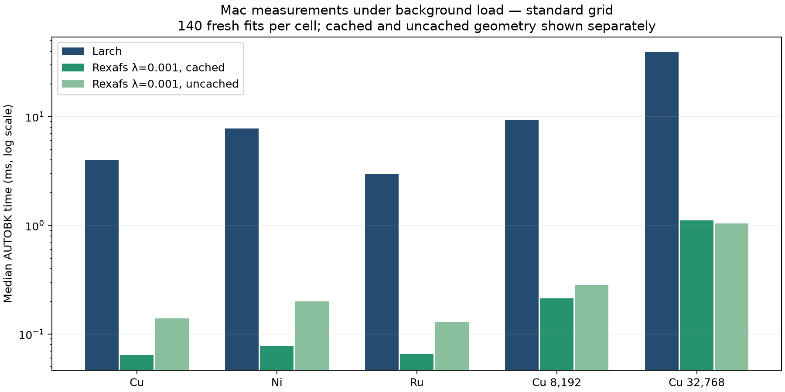

# Production fixed-λ AUTOBK: accuracy, timing and profiles

The Rust implementation now reproduces the study's fixed objective with
`clamp_lambda = 0.001`, a configurable endpoint regularizer, and one linear
coefficient solve. It does **not** add a separate coefficient/ridge penalty.
See the [objective and endpoint definition](../../autobk-fixed-penalty.md).

## Numerical validation

[validation.json](validation.json) retains 966 production/reference comparisons:
all 322 archived measured/synthetic/stress cases at λ=0, 0.001 and 1. The maximum
relative χ difference from the independent NumPy/SciPy prototype is **1.19e-12**.
Another 30 checks vary kmin and the start/end weights, including both ends
switched off; their maximum relative difference is **1.36e-13**. The reference
Larch code is unmodified. Both implementations now use CODATA 2022 constants.

The core regression fixture covers Cu, Ni, Ru, standard/fine grids, and synthetic
single-shell/FEFF signals. It additionally exercises cached/uncached geometry,
absorption gains of 0.1/1/10, and zero-penalty equivalence to disabled clamps.
The retained [known-background study](../2026-09-07-clamp-study/README.md) reports
signal recovery separately from agreement with Larch. Its weak penalties were
practically tied; λ=0.001 is not a claim of a universal optimum.

Actual Rust χ(k), compared with stock Larch over 2≤k≤12 Å⁻¹:

| Scan | Relative L2 difference |
| --- | ---: |
| Cu | 0.000594% |
| Ni | 0.001071% |
| Ru | 0.001642% |


The left panels include published rexafs 0.1.0. The right panels expand only the
new implementation's difference from Larch. [SVG](measured-chi.svg) and complete
output arrays in [chi-candidate.npz](chi-candidate.npz) /
[chi-published.npz](chi-published.npz) are retained.

## Initial Mac timings — background load was present

These measurements used an **Apple M4 (10 logical CPUs), macOS 26.5.1, Python
3.12.12, NumPy 2.5.2, SciPy 1.18.1 and XrayLarch 2026.3.1**. Other user builds
were active. Candidate-run one-minute load averages ranged from 14.4 to 18.0;
load increased substantially during the later published-package run. Therefore
**do not use the sequential old/new wall times as a clean regression ratio**.
A fresh-runner CI comparison is included in the PR to check the speed separately.

The same measured Cu/Ni/Ru inputs and linearly densified Cu scans (8,192/32,768
points) are evaluated at standard (kstep=0.05, nfft=2048) and fine
(kstep=0.025, nfft=8192) settings. E₀ and edge step are shared. The full
[matrix.csv](matrix.csv) has 90 timing cells across the two environments.

The candidate matrix includes Larch, fixed λ=0/0.001/1, cached and uncached
λ=0.001, and the legacy initial-scale policy in the current core. The separate
published matrix includes 0.1.0 cached/uncached and a repeated Larch control.

Median background times in the **same candidate run**, standard grid:

| Input | Fixed λ=.001 cached | Fixed λ=.001 uncached | Larch | Larch / cached |
| --- | ---: | ---: | ---: | ---: |
| Cu | 0.064 ms | 0.139 ms | 3.963 ms | 61.8× |
| Ni | 0.078 ms | 0.200 ms | 7.798 ms | 100.6× |
| Ru | 0.065 ms | 0.130 ms | 2.981 ms | 45.7× |
| Dense Cu, 8,192 | 0.213 ms | 0.283 ms | 9.384 ms | 44.2× |
| Dense Cu, 32,768 | 1.109 ms | 1.042 ms | 39.296 ms | 35.4× |

These initial ratios are observations under load, not guaranteed speedups. For
example, Ni's Larch p10–p90 range was 5.50–11.08 ms and Rust's was
0.061–0.173 ms. The cached/uncached reversal in the dense standard case should
not be read as evidence that disabling the cache is always faster.



Each timing cell has 140 retained fits: seven rounds of 20, after two warm-up
rounds. Method order is shuffled per round with a recorded seed. Each fit uses
fresh data containers and solves coefficients again; geometry caching does not
reuse a finished χ result. Threads are limited to one. Raw samples, p10/p90,
input hashes, preprocessing and parameters are in [timing-candidate.json](timing-candidate.json)
and [timing-published.json](timing-published.json).

The timed boundary is AUTOBK: Rust spectrum construction/normalization precede
the timer; the Larch reference wrapper creates its result group and calls AUTOBK
with the shared edge step. Timings include interpolation, design preparation
(unless cached), FFT work and coefficient solving. They exclude file loading,
the separate output Fourier transform and plot rendering. Additional Rust
construction+normalization+background samples are retained, but are not compared
with Larch's background-only samples.

## Why the gap occurs

Larch updates its clamp scale during a nonlinear fit. In the 300-fit Cu profile
it evaluated the residual **9,300 times (31 per fit)**; this repeats spline
resampling and transforms. The new fixed quadratic objective needs one
column-scaled SVD coefficient solve. Cubic raw-data interpolation uses O(n)
storage/work, and compatible spline/FFT geometry is reused when caching is on.
The remaining native work includes interpolation/basis evaluation, SVD and FFTs.
Larger raw scans increase preparation cost even though the coefficient count
is small. The change in constants is negligible for speed.

This comparison therefore combines algorithm and implementation differences;
it is not solely a Rust-versus-Python language comparison. Stronger λ also
changes the scientific objective and can harm some signals, so λ=1 is a
sensitivity configuration, not a speed recommendation.

## Profiling and provenance

The three `*.pstats` / `*-profile.txt` pairs profile 300 Cu fits for Larch and
cached/uncached fixed λ=.001. They are **profiles, not uninstrumented timing
benchmarks**. The Rust profile includes construction and normalization; the
Larch profile covers the reference AUTOBK call.

[native-profiles](native-profiles/) retains three successful macOS `sample`
captures of the **full normalization/AUTOBK/output-FFT pipeline** on fresh
spectra: 15-second workers, eight-second samples. Both original and demangled
compressed stacks are kept; demangling uses rustfilt 0.2.1 without changing sample
counts. Top-of-stack summaries include idle worker threads, so their counts must
not be interpreted as percentages of active CPU without excluding idle samples.

The installed extension hashes, dependency versions and source hashes are in
[provenance-candidate.json](provenance-candidate.json) and
[provenance-published.json](provenance-published.json). The candidate was built
from the working release branch based on `8d97a94`; its source patch and wheel
hash are retained separately. Published results use the actual 0.1.0 extension.

```sh
python scripts/benchmark-fixed-clamp.py --output RESULTS
# In a second environment with identical scientific dependencies and rexafs 0.1.0:
python scripts/benchmark-fixed-clamp.py --output RESULTS --timing-only --published
python scripts/report-fixed-clamp.py --output RESULTS
# macOS native profiling:
python scripts/profile-fixed-clamp.py --output RESULTS/native-profiles
```

The `Larch comparison` GitHub Actions workflow repeats the validation and both
package measurements on a fresh Ubuntu runner with pinned primary dependencies.
Its numerical outputs and timings are separate from these Mac measurements.
