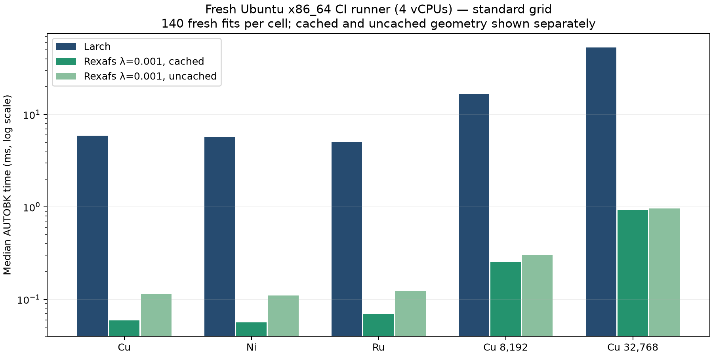
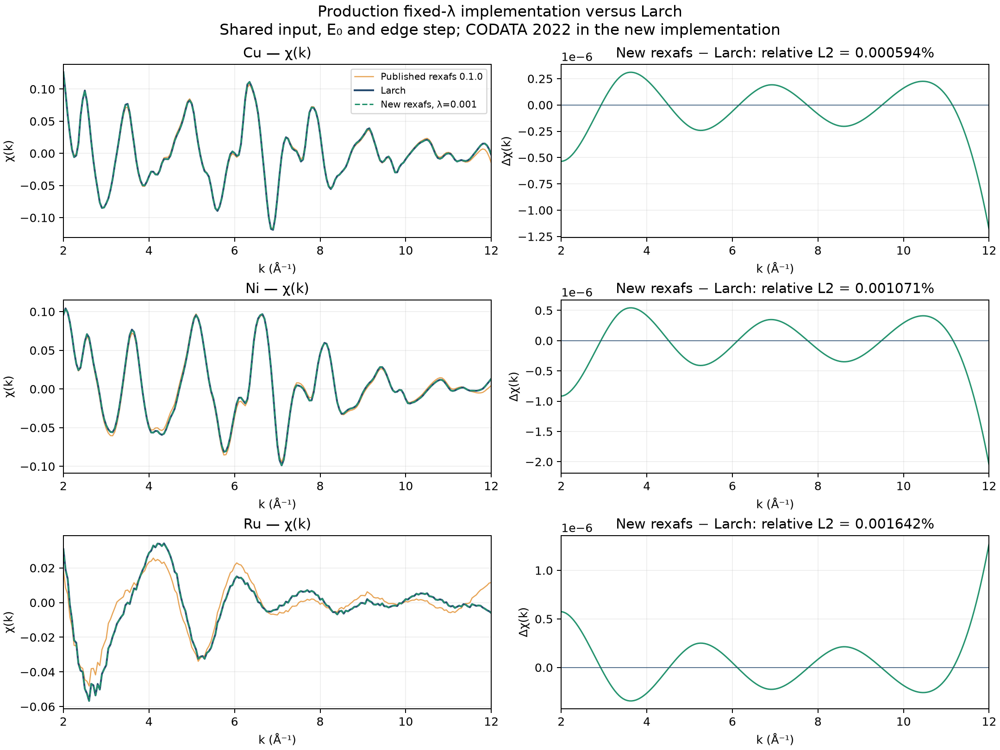

# Fresh Ubuntu runner: fixed-λ AUTOBK versus Larch and published rexafs

Source: [GitHub Actions run 34046599255](https://github.com/Ameyanagi/rexafs/actions/runs/34046599255),
artifact `fixed-lambda-larch-comparison`. PR head `2d757c54364ec264ba370f3bbca514817bf2bacc`
was checked out through GitHub's PR merge commit `2c3bf87b8675441a06239099a50f6eac1fbce47a`.
The recorded hashes identify the four numerical implementation files and the
installed extension. The benchmark's later tolerance changes do not change the
measured algorithm.

This is a fresh Ubuntu 24.04 x86_64 runner with four vCPUs and Python 3.12.14.
Larch 2026.3.1, NumPy 2.5.2, SciPy 1.18.1 and the other primary dependencies
are pinned in the workflow. [requirements-candidate.txt](requirements-candidate.txt)
also records transitive versions. Only rexafs is replaced for the published
0.1.0 run. The [candidate provenance](provenance-candidate.json) records OpenBLAS
and MKL libraries, all limited to one thread. Hardware/backend differences mean
these should not be treated as Mac timings.

The download contains timing samples, quantiles, χ arrays, validation, Python
profiles and provenance. Numerical data and binary profiles are unchanged; only
final blank lines were removed from text profile summaries. Original download
hashes are retained in [download.json](download.json). [matrix.csv](matrix.csv) and the
plots were generated from those files with:

```sh
python scripts/report-fixed-clamp.py --output THIS_DIRECTORY \
  --platform-label 'Fresh Ubuntu x86_64 CI runner (4 vCPUs)'
```

All 966 archived fixed-objective comparisons and 30 additional endpoint checks
passed. Their maximum relative L2 errors were 1.33e-12 and 1.08e-13 respectively.
This run preceded the stricter assertion thresholds; subsequent CI runs apply
the new `rtol=1e-11, atol=1e-12` bounds to the same reference arrays.

The 90 timing cells use the procedure and timed boundary described in the
[parent report](../README.md): matched parameters/E₀/edge step, 140 retained
fits per cell, shuffled method order, geometry reuse but fresh coefficient
solves. Raw `chi_relative_l2_vs_larch` fields cover the full k grid; the derived
matrix uses 2≤k≤kmax. The repeated Larch control medians differ by at most 1.1%
between the candidate and published-package runs.





Profiles measure 300 Cu fits and include profiler overhead. The Rust profile
includes construction and normalization, whereas the Larch profile covers the
AUTOBK wrapper. Use uninstrumented timing samples for performance ratios. No
native stack sampling was performed on this CI runner; the Mac native profiles
are retained in the parent directory.
