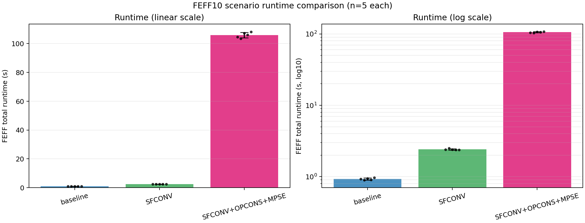
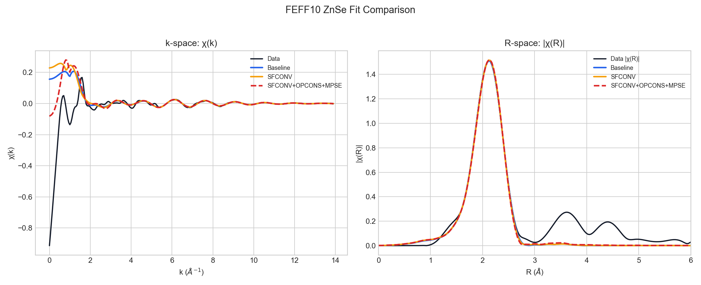
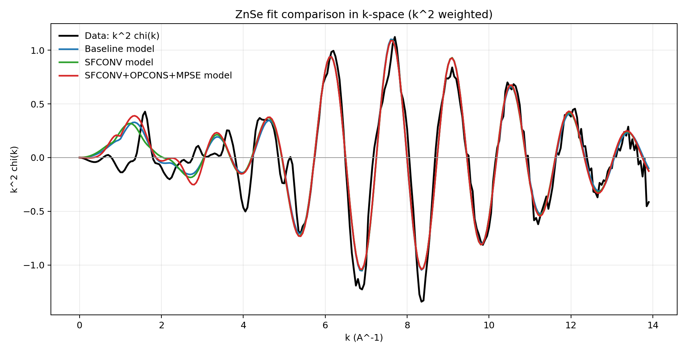
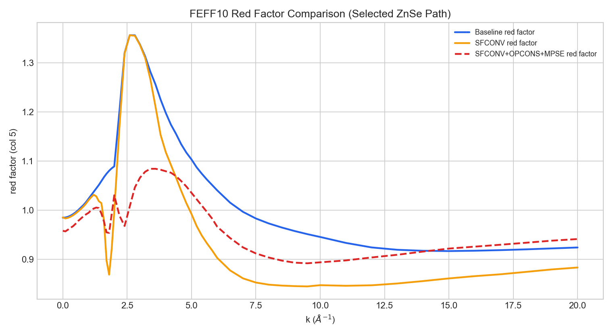

# FEFF10 ZnSe Card Comparison Report

Generated: 2026-03-03

## Scenarios

- `baseline`: no extra cards (`SFCONV`, `OPCONS`, `MPSE` all commented)
- `SFCONV`: `SFCONV` enabled
- `SFCONV+OPCONS+MPSE`: `SFCONV + OPCONS + MPSE 1 100` enabled (no `EPS0`)

## Runtime Summary (FEFF Calculation Only)

Timing measured from `feff10-cli --json run` total pipeline time, `n=5` per scenario.

| Scenario | Mean time (s) | Std (s) | Min (s) | Max (s) | Relative vs baseline |
|---|---:|---:|---:|---:|---:|
| baseline | 0.9258 | 0.0306 | 0.8904 | 0.9671 | 1.0x |
| SFCONV | 2.4077 | 0.0547 | 2.3646 | 2.5027 | 2.6x |
| SFCONV+OPCONS+MPSE | 105.8782 | 1.8840 | 103.4552 | 108.0981 | 114.4x |

## Fit Summary

| Scenario | amp +- stderr | de0 +- stderr | sig2 +- stderr | dr +- stderr | R-factor | chi_square | residual_rms |
|---|---:|---:|---:|---:|---:|---:|---:|
| baseline | 0.986205 +- 0.039992 | 3.684269 +- 0.516762 | 0.006529 +- 0.000308 | -0.000853 +- 0.002523 | 1.154603e-03 | 32.2654 | 0.155882 |
| SFCONV | 1.162749 +- 0.069218 | 2.560107 +- 0.756972 | 0.006655 +- 0.000450 | 0.011214 +- 0.003690 | 2.529008e-03 | 70.6732 | 0.171731 |
| SFCONV+OPCONS+MPSE | 1.197037 +- 0.066860 | 3.694348 +- 0.697733 | 0.006896 +- 0.000421 | 0.006489 +- 0.003408 | 2.211505e-03 | 61.8005 | 0.126690 |

## Plots

### Runtime Comparison

### Fit Comparison in k-space and R-space

### k-space Fit (k^2 weighted)

### Redfactor Comparison

## Data Files

- `timing_runs.csv`
- `feff10_baseline_sfconv_mpse_timed_summary.csv`
- `feff10_baseline_sfconv_mpse_comparison.csv`
